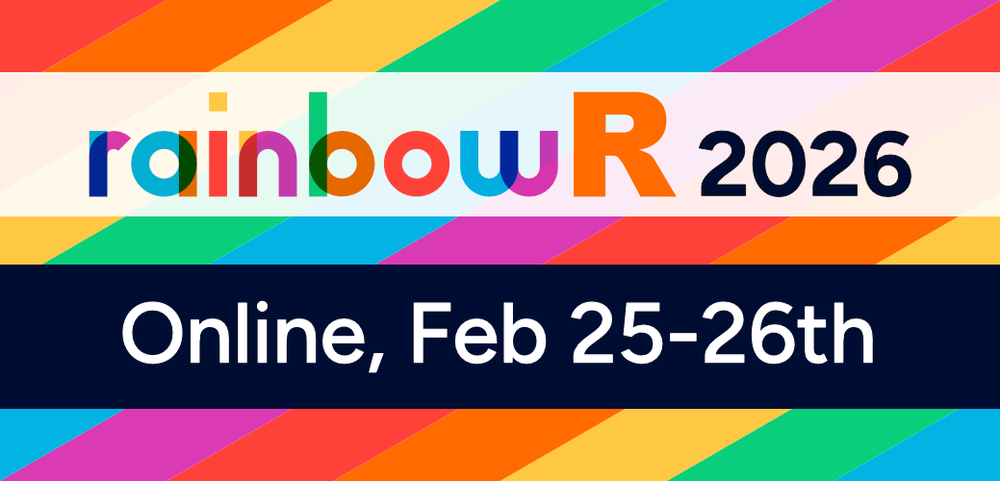
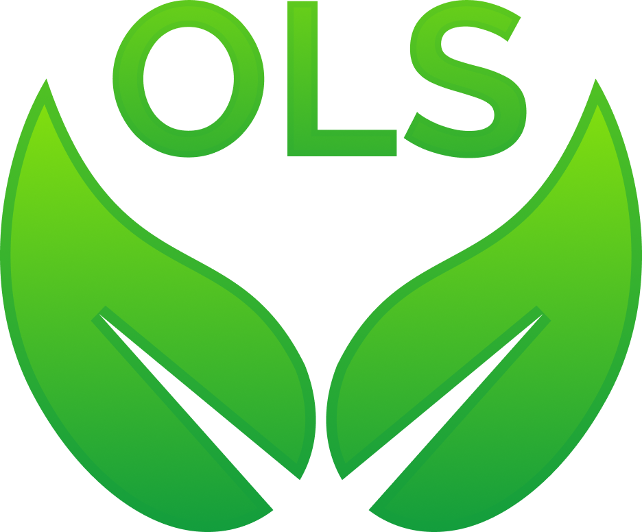

## Welcome

Welcome to the rainbowR conference. This template is ready for the next event: replace the placeholders on this page when the date, format, and registration details are confirmed.

The conference brings together LGBTQIA+ users of R and their allies to share work, make connections, and celebrate the breadth of our community.

## Who is the conference for?

The conference is for anyone interested in R and/or analysing data to understand LGBTQ+ issues. LGBTQ+ people and allies are welcome.

## About rainbowR

[rainbowR](https://rainbowr.org) connects, supports, and promotes LGBTQ+ R users, and spreads awareness of LGBTQ+ issues through data-driven activism.

## Important dates

- **Call for proposals opens:** To be confirmed
- **Proposal deadline:** To be confirmed
- **Registration opens:** To be confirmed
- **Conference:** To be confirmed

## Sponsored and supported by

Add confirmed sponsors and supporters here. The layout below follows the previous conference site; remove any unused columns.

::: {layout="[[55, -5, 40]]" style="margin-bottom: 2em;"}

{fig-alt="Sponsor logo placeholder"}

{fig-alt="Sponsor logo placeholder"}

:::

::: {layout="[[25, -75]]"}

{fig-alt="Sponsor logo placeholder"}

:::

Add any acknowledgements, donors, or solidarity-payment supporters below this section when they are confirmed.

## Contact

Contact [hello@rainbowr.org](mailto:hello@rainbowr.org) with any questions.
